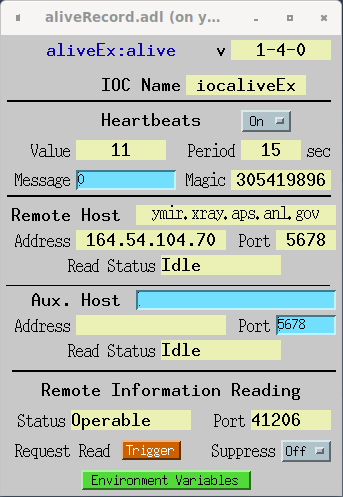
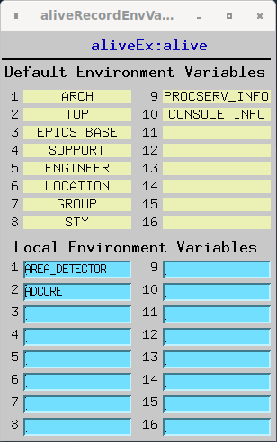

alive Record
============

Introduction
------------

The alive record is intended as a way to allow verification that an IOC is running. It is an active system, using heartbeat messages sent to a central server (such as [alived](https://github.com/epics-alive-server/alived)), which collects heartbeat messages and monitors the IOC statuses. The alive record also allows for the server to query extra information of the IOC, being environment variables (specified in the record) and system specific information (vxWorks boot line, Linux user, etc.)

This system has several important consequences. The server doesn't need to know which IOCs to monitor, as they will self-report themselves upon running a correctly configured alive record. The reading of the boot information also allows for real-time knowledge of the IOC type and boot parameters. The monitoring of IOCs is intended to be outside of EPICS itself, so there is no needing to link EPICS libraries. EPICS network boundary issues with subnets are avoided, as the heartbeat messages are sent as simple UDP packets and the extra information is done with a TCP request from the remote server.

This record could be extended to monitor real-time parameters (such as memory use, etc.), but that is not what this record is intended for. Once a system is known to be up, one should use typical EPICS methods for these things (like devIocStats). However, there is the 32-bit __MSG__ field ("Message Value" on the screen) which can be used to send messages as defined by the user.

 
- - - - - -

Operation
---------

The alive record does not process normally, as most of what it does is done in two threads separate from normal record processing. One thread will send UDP heartbeats every __HPRD__ seconds to a main remote server and optionally an auxiliary server, while the other thread listens for connections from the remote server(s). When the record actually does process, the current heartbeat count is returned as __VAL__.

The default heartbeat period is 15 seconds, which allows for declaring failure after a minute, if using four missing hearbeats as the condition. The heartbeating can be turned by setting __HRTBT__ to "Off".

- - - - - -

Record Fields
-------------

The __VAL__ field holds the current heartbeat value (initially zero), and is incremented each time a UDP heartbeat is sent, every __HPRD__ seconds, assuming __HRTBT__ is set to "On".

The heartbeat UDP packets are sent to a remote server using the __RHOST__ and __RPORT__ fields to specify address and port. The __RHOST__ can be a name or an IPv4 numeric address; the resulting IPv4 address is found in the __RADDR__ field.

The heartbeat packets can optionally also be sent to an auxiliary remote server, for purposes of server testing or backup. This feature uses the __AHOST__ and __APORT__ fields to specify address and port, and can be changed while the IOC is running. A valid name or an IPv4 numeric address __AHOST__ enables this feature, and the resulting IPv4 address is found in the __AADDR__ field, unless there was an error and then "invalid AHOST" will be found instead.

The IOC's actual name as reported to the remote server is contained in the __IOCNM__ field. __IOCNM__ can be directly set at boot time with a static value or an environment variable; if left empty, then the name will taken by the "IOC" environment variable. The server may employ a magic number to help filter out unwanted UDP packets sent to it, and this number is specified in the __HMAG__ field, and is the first thing sent in the heartbeat message; the default corresponds to 0x12345678. There is a 32-bit field that can be used to send a user-defined message to the server, __MSG__, and its usage is left up to the implementer.

Unless suppressed, the remote server can attempt to read back the environment variables and other information using the TCP port specified by __IPORT__. If initialized to 0, an available port will be found and its value placed this field, otherwise any nonzero value will be attempted. If multiple IOCs are on the same IP address, each alive record needs to use a unique port, which is taken care of automatically if all are initialized to 0. It should be noted that *only* connections originating from __RHOST__ will be allowed to connect this way. The status of the port can be found with __IPSTS__, which has three values set by the record: "Undetermined", which is the initial value; "Operable", meaning that the port was successfully opened; and "Inoperable", which means that there was a failure in opening the port. This field is to help debug use of the record.

The send a trigger flag to the remote server, signaling that it should reread the boot information, __ITRIG__ should be set to "Trigger", after which the record will change it back to "Idle". If triggered, the record will let the remote servers that they need to read information from the TCP server port, and the status of these reads are held in the __RRSTS__ (main server) and __ARSTS__ (auxiliary server) fields. The values are: "Idle", "Queued", "Due", and "Overdue". "Idle" means that no read is expected, "Queued" means that the record will send the read request on the next heartbeat, "Due" means that a request was sent on the last heartbeat, and "Overdue" means that a request was sent multiple heartbeats ago. If the server is working correctly, "Overdue" should not eventually appear after "Queued"; for a successful read "Due", will probably not be seen as the typical response is so fast. Aside from the trigger, modifying any allowable field value will trigger a read from the servers.

If one wants to suppress the server reading the boot information, __ISUP__ should be set to "On"; the record sends a suppress flag to the server, and will immediately close all connection that occur. This is useful if the IOC is behind a firewall that won't allow a direct TCP connection, telling the server to not endlessly try to read.

Names of the environment variables to be sent to the remote server upon request are __EVD1__-__EVD16__ and __EV1__-__EV16__. If the length of the value of a variable is over 65535, an empty string will be sent back. The __EVD__ variables are set as defaults that aren't changed after boot, while the __EV__ variables are available to be used after boot. This separation allows global defaults to be set for all IOCs, while allowing variables to be added locally with disregard to the defaults.

The release version number of the record is kept in __VER__ as a string, in the form of "X-Y-Z". A development version will have a string in the form of "X-Y-Z-devA".

| Field |                    Summary               |                   Type                | DCT | Default | Access | Modify | Rec Proc Monitor | PP |
|-------|------------------------------------------|---------------------------------------|-----|:-------:|--------|--------|------------------|----|
| VAL   | Heartbeat Value                          | ULONG                                 | No  |    0    | Yes    | No     | No               | No |
| RHOST | Remote Host Name or IP Address           | STRING                                | Yes |         | Yes    | No     | No               | No |
| RADDR | Remote Host IP Address                   | STRING                                | No  |         | Yes    | No     | No               | No |
| RPORT | Remote Host UDP Port Number              | USHORT                                | Yes |    0    | Yes    | No     | No               | No |
| RRSTS | Remote Host Read Status                  | Menu: Idle/Queued/Due/Overdue         | Yes |  Idle   | Yes    | No     | No               | No |
| AHOST | Aux. Remote Host Name or IP Address      | STRING                                | Yes |         | Yes    | Yes    | Yes              | No |
| AADDR | Aux. Remote Host IP Address              | STRING                                | No  |         | Yes    | No     | No               | No |
| APORT | Aux. Remote Host UDP Port Number         | USHORT                                | Yes |    0    | Yes    | Yes    | Yes              | No |
| ARSTS | Aux. Remote Host Read Status             | Menu: Idle/Queued/Due/Overdue         | Yes |  Idle   | Yes    | No     | No               | No |
| HRTBT | Heartbeating State                       | Menu: Off/On                          | Yes |   On    | Yes    | Yes    | Yes              | No |
| HPRD  | Heartbeat Period                         | USHORT                                | Yes |   15    | Yes    | No     | No               | No |
| IOCNM | IOC Name Value                           | STRING                                | Yes |         | Yes    | No     | No               | No |
| HMAG  | Heartbeat Magic Number                   | ULONG                                 | Yes |305419896| Yes    | No     | No               | No |
| MSG   | Message to Send                          | LONG                                  | Yes |    0    | Yes    | Yes    | No               | No |
| IPORT | TCP Information Port Number              | USHORT                                | Yes |    0    | Yes    | No     | No               | No |
| IPSTS | Information Port Status                  | Menu: Undetermined/Operable/Inoperable| Yes |Undetermined | Yes | No    | Yes              | No |
| ITRIG | Trigger Information Request              | Menu: Idle/Trigger                    | Yes |  Idle   | Yes    | Yes    | Yes              | No |
| ISUP  | Suppress Information Requests            | Menu: Off/On                          | Yes |   Off   | Yes    | Yes    | Yes              | No |
| VER   | Record Version                           | STRING                                | Yes |         | Yes    | No     | No               | No |
| EVD1  | Default Environment Variable Name 1      | STRING                                | Yes |         | Yes    | No     | No               | No |
| ...   | ...                                      | ...                                   | ... |   ...   | ...    | ...    | ...              | ...|
| EVD16 | Default Environment Variable Name 16     | STRING                                | Yes |         | Yes    | No     | No               | No |
| EV1   | Environment Variable Name 1              | STRING                                | Yes |         | Yes    | Yes    | Yes              | No |
| ...   | ...                                      | ...                                   | ... |   ...   | ...    | ...    | ...              | ...|
| EV16  | Environment Variable Name 16             | STRING                                | Yes |         | Yes    | Yes    | Yes              | No |

- - - - - -

Record Support Routines
-----------------------

### init\_record

The current time is recorded as the IOC boot time. A UDP socket is opened for sending heartbeat messages. An address structure for the remote server is initialized, using __RHOST__ and __RPORT__, with the numeric IP address put into __RADDR__. The name of the IOC is read from the __IOCNM__ field, and if that is empty, from the "IOC" environment variable.

A thread is spawned for accepting TCP requests from the remote server on port __IPORT__; if this port value is zero, the record will get an automatically assigned port, updating __IPORT__ with the actual value. The success of opening this port can be seen with __IPSTS__. The TCP port will only accept requests from the IP address specified in __RADDR__ (or __AADDR__ if an auxiliary server is in use), and as long as __ISUP__ is Off. The message sent back upon request is a list of the specified environment variables, the IOC type, and the data special to that type.

If the __HPRD__ is initially zero, then it is reassigned to the default value, which is currently 15.

### process

Nothing actually happens, other than the forward link get processed. Heartbeats are controlled purely by a timed thread.

### special

Changing the __RHOST__ field causes a check here to make sure that the string value is a properly formed IP address. If not, no sending heartbeats will occur.

- - - - - -

Message Protocol
----------------

This section describes the current protocol, version __5__. All messages sent use network order (big-endian).

### Heartbeat Message

This is the UDP message sent for each processing of the record. The minimum size for a message payload is 30 bytes, being being fixed fields of 28 bytes with a null-terminated string. All values are unsigned.

The time values sent are EPICS time values, which are relative to 1990. Converting them to standard Linux time values means adding a value of 631152000 (20 years of seconds) to each.

| Offset (bytes) |       Field     |
|:--------------:|:---------------:|
|      0 - 3     |      Magic      |
|      4 - 5     |     Version     |
|      6 - 9     |   Incarnation   |
|     10 - 13    |   Current Time  |
|     14 - 17    | Heartbeat Value |
|     18 - 19    |      Period     |
|     20 - 21    |      Flags      |
|     22 - 23    |   Return Port   |
|     24 - 27    |  User Message   |
|     28 - ...   | IOC Name (len X)|
|     28 + X     |        0        |

* __Magic Number__ (32-bit)  The value of this field comes form the __HMAG__ field. It is used by the remote server to delete messages received that don't start with this number.  
* __Version of Protocol__ (16-bit)  The value of this field is the current version of the protocol for this record. The remote server can handle or ignore a particular version as it sees fit. If the version number does not match the one that this document describes, the fields after this one will most likely differ in some way.  
* __Incarnation__ (32-bit)  This value is a unique number for this particular boot of the IOC. It's also the boot time as measured by the IOC, which should be unique for each boot, assuming that the EPICS time is correct when the record initialization happens.  
* __Current Time__ (32-bit)  This is the current time as measure by the IOC.  
* __Heartbeat Value__ (32-bit)  This is the current value of the __VAL__ field  
* __Period__ (16-bit)  This is the heartbeat period used by the alive record, which is to be used for determining the operational status of the IOC, and comes from __HPRD__.  
* __Flags__ (16-bit)  This value holds bit flags for the server.   
    - __Bit 0:__ Server should read the environment variables, as there are updated values or __ITRIG__ was set. This will be cleared after a successful read.
    - __Bit 1:__ Server is not allowed to read the environment variables, and will be blocked if tried. This is set by __ISUP__, and this bit overrides bit 0.
    
* __Return Port__ (16-bit)  This is the return TCP port number to use for reading IOC information, from __IPORT__.  
* __User Message__ (32-bit)  Whatever is in __MSG__ will be included here.  
* __IOC Name__ (variable length 8-bit)  This is the value of the environment variable *IOC*, and is null-terminated.  
  

### Information Request Message
    
This is the message that is read from the TCP port __IPORT__ on the IOC. When the port is opened, the IOC will write this message and then immediately close the port. There is no way to write a message to the IOC this way.

If the suppression __ISUP__ field is set to "On", the IOC will immediately close any connection whatsoever to this port (ideally the socket would simply be closed, but that would make things more complicated in the implementation).

| Offset (bytes) |       Field     |
|:--------------:|:---------------:|
|      0 - 1     |    Version      |
|      2 - 3     |    IOC Type     |
|      4 - 7     | Message Length  |
|      8 - 9     | Variable Count  |

* __Version of Protocol__ (16-bit)  The value of this field is the current version of the protocol for this record. The remote server can handle a previous version or ignore them as it sees fit.  __IOC Type__ (16-bit)  Stores type of IOC. Currently only two types are defined. This value also determines the type of extra information that is at the end of the message.  
    - __0)__ Generic: No extra information.
    - __1)__ VxWorks: The boot parameters are sent.
    - __2)__ Linux: The user and group IDs of the process as well as the hostname are sent.
    - __3)__ Darwin: The user and group IDs of the process as well as the hostname are sent.
    - __4)__ Windows: The login name and machine name are sent.
    
* __Message Length__ (32-bit)  This is the length of the entire message.  
* __Variable Count__ (16-bit)  This is the number of environment variables sent. Only values for non-empty __EVDxx__ and __EVxx__ fields are sent.   At this point of the message, byte 10, the locations become variable due to the variable nature of the data. The environment variables are sent as multiple records, the number being __Variable Count__.

| Offset (bytes) |         Field       |
|:--------------:|:-------------------:|
|        0       |   Name Length (X)   |
|      1 - X     |    Variable Name    |
|    X+1 - X+2   | Variable Length (Y) |
|    X+3 - X+Y+2 |   Variable Value    |

* __Name Length__ (8-bit)  This is the length of the environment variable name.  
* __Variable Name__ (variable length 8-bit)  This is the name of the environment variable (cannot be an empty string).  
* __Value Length__ (16-bit)  This is the length of the environment variable value. If the value was over 16-bits in size (64kb), an empty string is returned.  
* __Variable Value__ (variable length 8-bit)  This is the value of the environment variable. If the variable did not exist on the IOC, this is an empty string (size 0).   If the value of __IOC Type__ is non-zero, there may be extra data at this point. Currently both supported types do include data, so the extra information presented below is present for vxWorks, Linux, and Darwin.

#### vxWorks

For vxWorks, the extra information is the boot parameters. The data is either in a string or a number. A string is represented by an 8-bit string length, followed by the string itself. The number is a 32-bit number.
    
* __Field Order__
    * Boot Device (str)       
    * Unit Number (int)       
    * Processor Number (int)  
    * Boot Host Name (str)    
    * Boot File (str)         
    * Address (str)           
    * Backplane Address (str) 
    * Boot Host Address (str) 
    * Gateway Address (str)   
    * User Name (str)         
    * User Password (str)     
    * Flags (int)             
    * Target Name (str)       
    * Startup Script (str)    
    * Other (str)   

#### Linux and Darwin

For Linux and Darwin, the extra information is the user and group IDs of the IOC process, as well as the hostname of the host computer. The data are represented by an 8-bit string length, followed by the string itself.
    
* __Field Order__
    * User ID (str)  
    * Group ID (str) 
    * Hostname (str) 

    
#### Windows

For Windows, the extra information is the login name of the IOC process, as well as the machine name of the host computer. The data are represented by an 8-bit string length, followed by the string itself.
    
* __Field Order__
    * Login name (str)   
    * Machine name (str) 
    
- - - - - -
